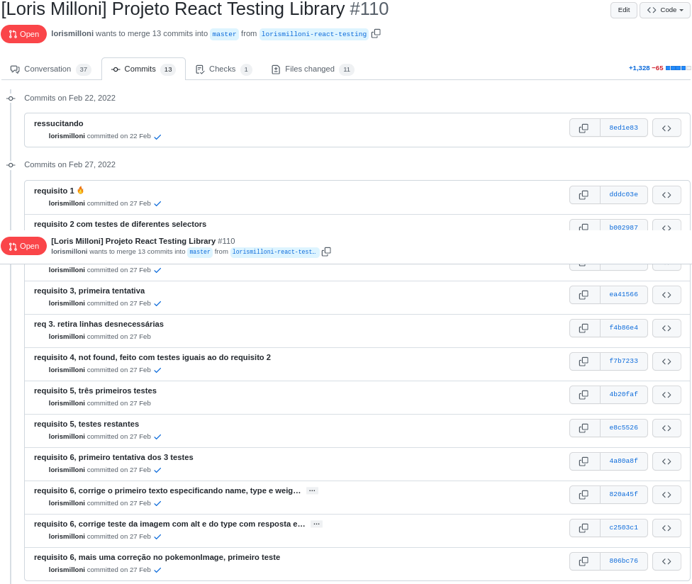
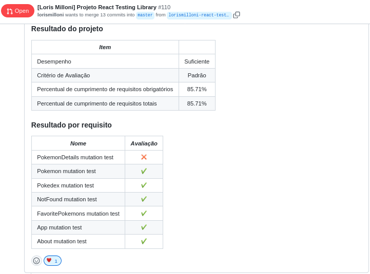

# studies-frontend-react-testing-library
Made in **27/02/2022**.

## In this assignment we made tests for a React application using Jest and React Testing Library.

#### The goal was to use queries from RTL in auto tests, simulate events, test logical asynchronous flows, create mocks using fetch and test inputs.
  

#### Here is a code snippet:
 ```javascript
 describe('Teste o componente About', () => {
  test('Teste se a página contém as informações sobre a Pokédex em dois <p>', () => {
    renderWithRouter(<About />);
    // chamamos a helper passando o componente a ser renderizado.
    const paragraphs = screen.getAllByText(/pokémons/i);

    // expect(paragraphs).toBeInTheDocument();
    expect(paragraphs).toHaveLength(2);
  });
  test('Teste se a página contém um heading h2 com o texto About Pokédex', () => {
    renderWithRouter(<About />);
    const aboutTitle = screen
      .getByRole(
        'heading',
        { name: /about pokédex/i },
        { level: 2 },
      );

    expect(aboutTitle).toBeInTheDocument();
  });
  test('Teste se a página contém uma imagem específica de uma Pokédex', () => {
    renderWithRouter(<About />);
    const img = screen.getByAltText(/pokédex/i);
    const url = 'https://cdn2.bulbagarden.net/upload/thumb/8/86/Gen_I_Pok%C3%A9dex.png/800px-Gen_I_Pok%C3%A9dex.png';

    expect(img).toHaveAttribute('src', url);
    expect(img).toBeInTheDocument();
  });
});
 ```

#### Trybe has a private repository with files that can't be shared. So here is my commit history print:


#### Here is the Trybe Evaluator

